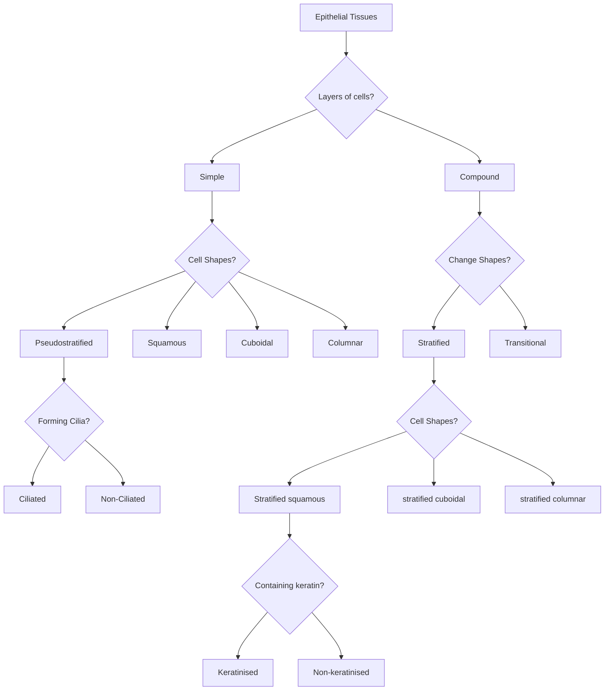
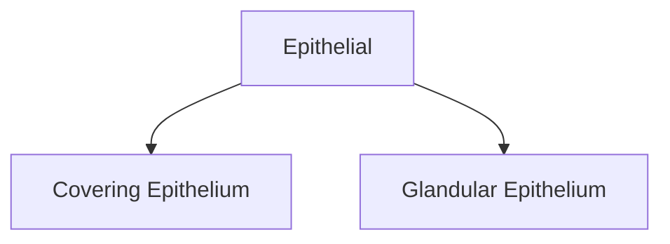
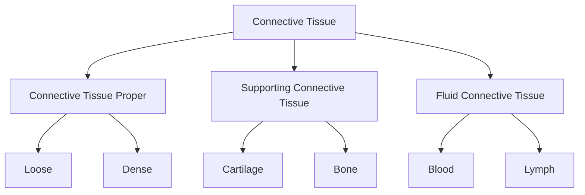

# LO: Explain the organisation and structure of the four basic human tissue types (epithelium, connective tissue, muscle and nervous tissue) and describe how cell and tissue structure facilitates normal organ function

[Histology](Histopathology.md) - Study of tissues.

## Tissue:
* Nervous - Ectoderm
* Epithelial - Endoderm
* Muscle - Mesoderm
* Connective - Mesoderm

## Epithelium:

**Apical** - Top
**Basal** - Bottom

This flow chart took me forever holy 

**Simple** - Just single layer
**Stratified** - Tall, a few layers
**Squamous** - Deflated very flat
**Cuboidal** - Very cube not flat
**Columnar** - Rectangle cigarettes
**Pseudostratified** - Very tall but still single layer

**Cilia** - Absorption and secretion, microvilli and goblet cells to increase surface area

## Epithelial tissue

**Exocrine** - Uses a duct to secrete
**Endocrine** - No duct, secrete directly into blood

### Epithelial
* Ectoderm, Mesoderm, Endoderm
* Line and cover surfaces
* Cells join via adhesion molecules and junctional complexes
* Anchor to basement membrane
* Cells have structural and functional polarity

**Simple Epithelium** - Single layer of cells so good for gas exchange (lungs)

### Transitional
* Extend and return
* Different shapes
* Changes shape

## Muscle
* **Skeletal** - Multiple nuclei, Striated
* **Cardiac** - Single nucleus, Striated, Branched
* **Smooth** - Single nucleus, non-striated

|          | Nucleus  | Striated | Branched |
| -------- | -------- | -------- | -------- |
| Skeletal | Multiple | ✅        |          |
| Cardiac  | One      | ✅        | ✅        |
| Smooth   | One      |          |          |

### Skeletal

* Actin and Myosin, leads to sarcomeres so striated

### Smooth 

*  Spindle shape
* Tapered edge
* Thick centre

### Cardiac

* Short, branched
* Striated
* Intercalated discs where muscles connect at the branched bit.

## Connective Tissue
1. Cells
2. Fiber
3. Ground substance (gel)

### Proper
* Hold organs
* Loose, more gel less fiber
* Dense, less gel more fiber

### Blood
* Erythroid precursors -> Red blood cells
* Megakaryocyte -> Platelets
* Neutrophils look like Mickey Mouse
* Macrophage means big eat
* Plasma cells have eccentric nucleus (on one side)

## Nervous
* Schwann cells (neurolemmocytes) - forms myelin sheath
* Endoneurium - thin layer of connective tissue
