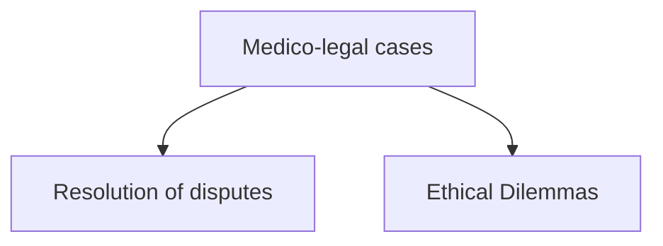

# LO: Describe the basic structure of the English legal system as it relates to medicine.

## Law:
* Establish and define standard of acceptable behaviour
* Maintain standards and punish 'offenses'
* Protect the vulnerable
* Achieve the resolution of disputes

## Issues that will be covered during the course:
1. **Consent** - respect for autonomy
2. Acting in accordance with **professional standards**
3. What to do **when things g
# LO: Describe basic legal principles, e.g. the common law system of precedent, tort, contract and the Human Rights Act (HRA).