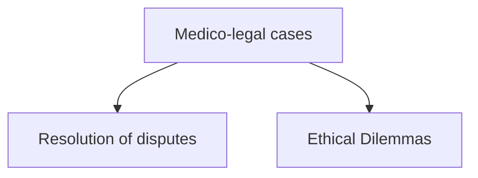
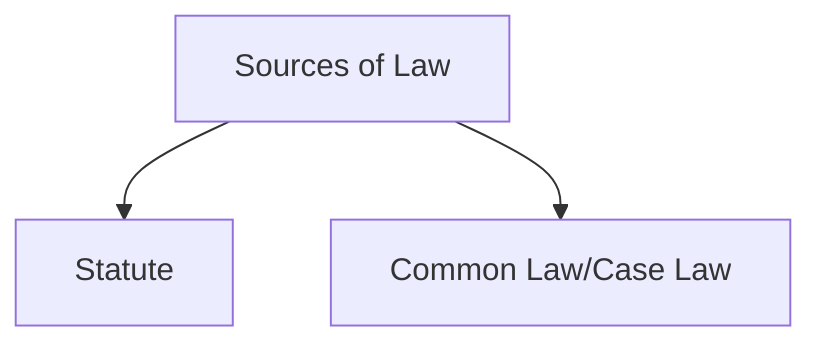
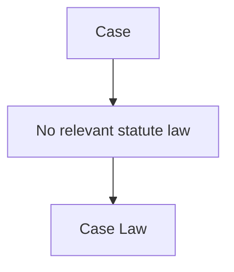
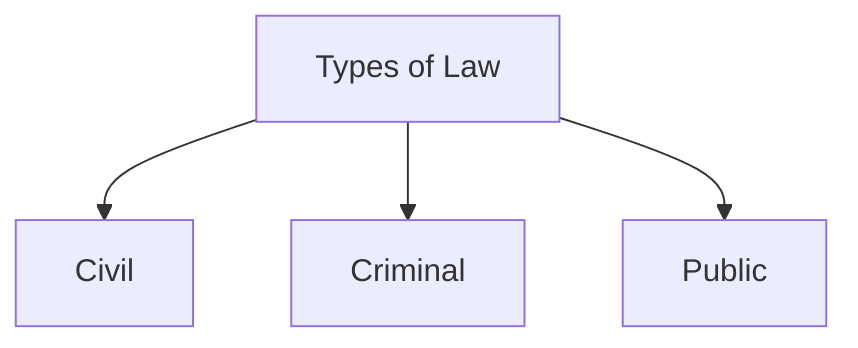
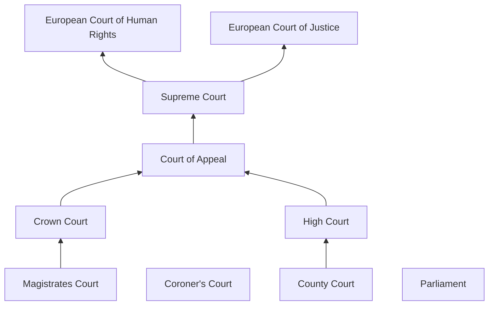

# LO: Describe the basic structure of the English legal system as it relates to medicine.

## Law:
* Establish and define standard of acceptable behaviour
* Maintain standards and punish 'offenses'
* Protect the vulnerable
* Achieve the resolution of disputes

## Issues that will be covered during the course:
1. **Consent** - respect for autonomy
2. Acting in accordance with **professional standards**
3. What to do **when things go wrong**
4. Protecting patient **confidentiality**
5. Acting in the best interests of vulnerable patients - **children**, those lacking **mental capacity** and people with **mental illness**
6. **Abortion** and reproduction, **infectious diseases** and proper **use of human tissue**
# LO: Describe basic legal principles, e.g. the common law system of precedent, tort, contract and the Human Rights Act (HRA).

## Statute:
1. Bill proposed
2. 1st reading - Bill introduced and published
3. 2nd reading - Bill debated and voted on
4. Committee Stage - line by line examination of the Bill
5. Report Stage - Changes can be suggested and debated
6. 3rd reading - final debate and vote
7. Bill should then move to the House of Lords
8. House of Lords can make changes which needs to be considered by House of Commons
9. House of Lords $\rightleftharpoons$ House of Commons until agreement, if no agreement Bill will fail

## Human Rights Act 1998 (HRA)
* Article 2 - Right to life
* Article 3 - Prohibition on torture and inhuman or degrading treatment
* Article 5 - Right to liberty and security
* Article 8 - Right to respect for private and family life
* Section 3(1) requires all 'public authorities' to act in compliance e.g. NHS

**HRA in Healthcare**

|                       | Article 2 | Article 3 | Article 5 | Article 8 |
| --------------------- | --------- | --------- | --------- | --------- |
| Life and Death issues | ✅         | ✅         |           | ✅         |
| Mental Health         |           |           | ✅         | ✅         |
| Confidentiality       |           |           |           | ✅         |
| Access to Treatment   | ✅         |           |           |           |

## Case Law:

### Regulation and Professional Guidance
* EU Directive - European Working Time Directive; consumer protection
* GMC - licensing of doctors
* Regulatory Bodies - HSE, PHSO, Human Tissue Authority, HFEA

## Types of Law:

### Civil Cases:
* Contract law - exchange of 'legal consideration' in contracts
* Contracts of employment, for goods and services e.g. private health care
* **Tort** - Provide a remedy to persons who have been harmed by the conduct of others. e.g. car accidents, negligent accidents in healthcare

### Clinical Negligence (Claimant, the patient, must establish 4 things):
1. They were owed <u>a duty of care</u> 
2. The duty of care was "<u>breached</u>"
3. They have sustained and injury (loss)
4. Injury was "<u>caused</u>" by that breach of duty (causation)

The claimant has the burden of proof 'on the balance of probabilities' (51/49%) they suffered and injury as a direct cause of the sub-standard treatment

There will be a breach of duty of care if a doctor: "... fails to act in accordance with the standards of reasonably competent medical men acting in the relevant field at the relevant time" McNair J

### Criminal Law:
* Consent issues
* End of life issues
* Gross negligence manslaughter
* Confidentiality

### Civil Law  v Criminal Law:

| Civil                                  | Criminal                                  |
| -------------------------------------- | ----------------------------------------- |
| Private disputes between 'individuals' | Public wrongs prosecuted by the State     |
| **Balance of probabilities**           | **Beyond reasonable doubt**               |
| Vicarious liability                    | Individual responsibility                 |
| Outcome - financial damages            | Range of punishments (fines/imprisonment) |

### Public Law - Judicial Review:
* Lawfulness of policies concerning prescription
* Redesign of mental health services
* Hugely contentious

### Public Inquiry:
* Major investigations - government minister
* Inquiries Act 2005
* Compel testimony and release of other forms of evidence
1. What happened?
2. Why did it happen and who is to blame?
3. What can be done to prevent this happening again?

## English Court System:

