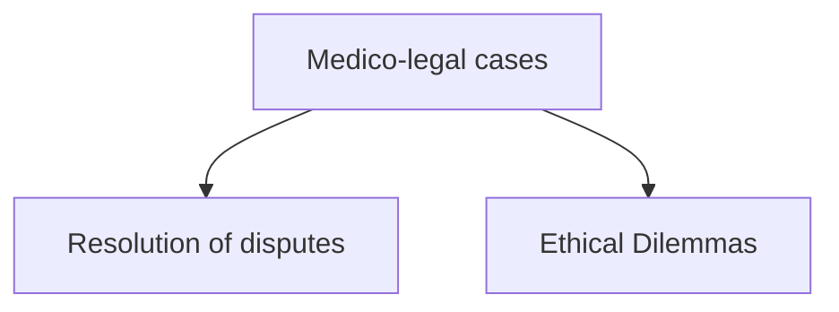
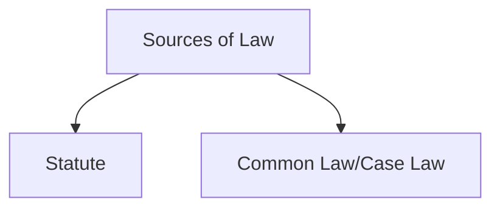

# LO: Describe the basic structure of the English legal system as it relates to medicine.

## Law:
* Establish and define standard of acceptable behaviour
* Maintain standards and punish 'offenses'
* Protect the vulnerable
* Achieve the resolution of disputes

## Issues that will be covered during the course:
1. **Consent** - respect for autonomy
2. Acting in accordance with **professional standards**
3. What to do **when things go wrong**
4. Protecting patient **confidentiality**
5. Acting in the best interests of vulnerable patients - **children**, those lacking **mental capacity** and people with **mental illness**
6. **Abortion** and reproduction, **infectious diseases** and proper **use of human tissue**
# LO: Describe basic legal principles, e.g. the common law system of precedent, tort, contract and the Human Rights Act (HRA).

## Statute:
1. Bill proposed
2. 1st reading - Bill introduced and published
3. 2nd reading - Bill debated and voted on
4. Committee Stage - line by line examination of the Bill
5. Report Stage - Changes can be suggested and debated
6. 3rd reading - final debate and vote
7. Bill should then move to the House of Lords
8. House of Lords can make changes which needs to be considered by House of Commons
9. House of Lords $\rightleftharpoons$ House of Commons until agreement, if no agreement Bill will fail

## Human Rights Act 1998
* Article 2 - Right to life
* Article 3 - Prohibition on torture and inhuman or degrading treatment
* Article 5 - Right to liberty and security
* Article 8 - Right to respect for private and family life
* Section 3(1) requires all 'public authorities' to act in compliance e.g. NHS

**HRA in Healthcare**

|                       | Article 2 | Article 3 | Article 5 | Article 8 |
| --------------------- | --------- | --------- | --------- | --------- |
| Life and Death issues |           |           |           |           |
|                       |           |           |           |           |
|                       |           |           |           |           |
|                       |           |           |           |           |
