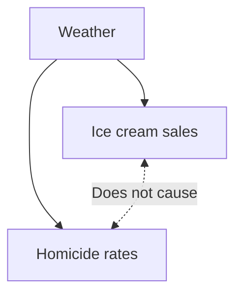

# LO: Describe and compare the design, strengths, limitations and appropriate use of common research methodologies (RCTs, quasi-experimental studies, cohort studies, case-control studies, systematic reviews and meta-analyses) and explain how these relate to the hierarchy of evidence.
## Interventional studies
* Participants allocated to receive one or more interventions (new drugs, device or behaviour change) to compare outcomes
* **Randomised controlled trials** (**RCTs**) - main interventional study design

## Randomised controlled studies (RCTs)
* Randomly allocate to groups - control and comparator group
* Interested in a particular group
* **CONSENT!!!!!**
## PICO
* Useful for summarising studies

|                  |                                      |
| ---------------- | ------------------------------------ |
| **P**opulation   | Sample type                          |
| **I**ntervention | Alternative hypothesis H<sub>1</sub> |
| **C**ontrol      | Null hypothesis H<sub>0</sub>        |
| **O**utcome      | Change/no change                     |

## Experiments
* Evidence of causation
* **Confounder** - variable that influences both dependent (exposure) and independent variable (outcome), causes a spurious relationship



* In this example, weather is the confounder.

## Randomisation
* Distribute confounders equally so balanced across arms
* Large sample needed
* Difference found is more likely to relate only to the intervention
* May not be ethical - withholding treatment
* Logistically infeasible
* Resource intensive

## RCT limitations
* Bias - systematic deviation from truth
* RCTs subject to bias

### Volunteer bias
* Difference between those who choose and choose not to participate
* Reduces generalisability - application to larger population from subset of population
* **Solution**: reduce barriers to participation - incentivisation

### Selection bias
* Groups differ in characteristics due to the way of selection
* Benefits of randomisation lost or reduced - increased confounding
* **Solution**: allocation concealment - protocols

### Performance bias
* Differences in care provided/participant behaviour separate from intervention
* Obscures impact of intervention
* **Solution**: blinding (masking)

### Lost to follow-up bias
* Difference between drop outs within groups
* Jeopardises comparability of groups
* **Solution**: minimise dropout - intention to treat

### Detection bias
* Difference in outcome assessment
* Affects measuring true effect
* **Solution**: blinding of outcomes assessor

### Reporting bias
* Selective outcome reporting
* Focus on positives - biased literature
* **Solution**: publish protocols - statistical analysis

### Where bias can occur
```
```